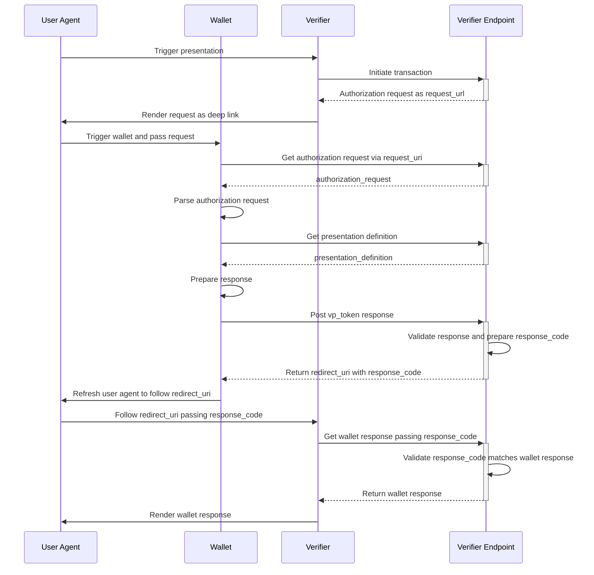
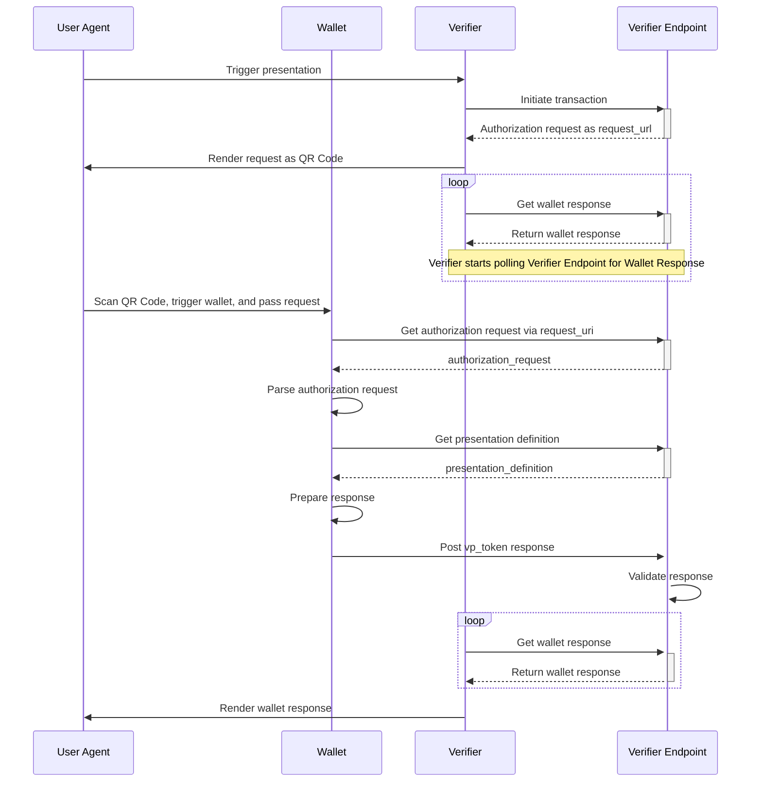

# EUDI Verifier Endpoint

**Important!** Before you proceed, please read
the [EUDI Wallet Reference Implementation project description](https://github.com/eu-digital-identity-wallet/.github/blob/main/profile/reference-implementation.md)

[](https://www.apache.org/licenses/LICENSE-2.0)

## Table of contents

* [Overview](#overview)
* [Disclaimer](#disclaimer)
* [Presentation Flows](#presentation-flows)
* [How to build and run](#how-to-build-and-run)
* [Run all verifier components together](#run-all-verifier-components-together)
* [Endpoints](#endpoints)
* [Configuration](#configuration)
* [How to contribute](#how-to-contribute)
* [License](#license)

 
## Overview

This is a Web application (Backend Restful service) that acts as a Verifier/RP trusted end-point. 
This backend service is accompanied by a Web UI application implemented [here](https://github.com/eu-digital-identity-wallet/eudi-web-verifier). 

See section [Run all verifier components together](#run-all-verifier-components-together) on how to boot both applications together.

Application exposes two APIs
* [Verifier API](src/main/kotlin/eu/europa/ec/eudi/verifier/endpoint/adapter/input/web/VerifierApi.kt)
* [Wallet API](src/main/kotlin/eu/europa/ec/eudi/verifier/endpoint/adapter/input/web/WalletApi.kt)

The Verifier API, supports two operations:
* [Initialize Transaction](src/main/kotlin/eu/europa/ec/eudi/verifier/endpoint/port/input/InitTransaction.kt), where Verifier may define whether it wants to request a SIOP or OpenID4VP or combined request
* [Get Wallet response](src/main/kotlin/eu/europa/ec/eudi/verifier/endpoint/port/input/GetWalletResponse.kt), where Verifier receives depending on the request an `id_token`, `vp_token`, or an error  

An Open API v3 specification of these operations is available [here](src/main/resources/public/openapi.json).

The Wallet API, provides the following main operations
* [Get Request Object](src/main/kotlin/eu/europa/ec/eudi/verifier/endpoint/port/input/GetRequestObject.kt) according JWT Secured Authorization Request
* [Get Presentation Definition](src/main/kotlin/eu/europa/ec/eudi/verifier/endpoint/port/input/GetPresentationDefinition.kt) according to OpenId4VP in case of using `presentation_definition_uri`
* [Direct Post](src/main/kotlin/eu/europa/ec/eudi/verifier/endpoint/port/input/PostWalletResponse.kt) according to OpenID4VP `direct_post`

Please note that 
* Both APIs need to be exposed over HTTPS.  
* Verifier API needs to be protected to allow only authorized access. 

Both of those concerns have not been tackled by the current version of the application, 
since in its current version is merely a development tool, rather a production application.

## Disclaimer

The released software is a initial development release version: 
-  The initial development release is an early endeavor reflecting the efforts of a short timeboxed period, and by no means can be considered as the final product.  
-  The initial development release may be changed substantially over time, might introduce new features but also may change or remove existing ones, potentially breaking compatibility with your existing code.
-  The initial development release is limited in functional scope.
-  The initial development release may contain errors or design flaws and other problems that could cause system or other failures and data loss.
-  The initial development release has reduced security, privacy, availability, and reliability standards relative to future releases. This could make the software slower, less reliable, or more vulnerable to attacks than mature software.
-  The initial development release is not yet comprehensively documented. 
-  Users of the software must perform sufficient engineering and additional testing in order to properly evaluate their application and determine whether any of the open-sourced components is suitable for use in that application.
-  We strongly recommend to not put this version of the software into production use.
-  Only the latest version of the software will be supported

## How to build and run

To start the service locally you can execute 
```bash
./gradlew bootRun
```
To build a local docker image of the service execute
```bash
./gradlew bootBuildImage
```

## Run all verifier components together

To start both verifier UI and verifier backend services together a docker compose file has been implemented that can be found [here](docker/docker-compose.yaml)
Running the command below will start the following service:
- verifier: The Verifier/RP trusted end-point 
- verifier-ui: The Verifier's UI application
- haproxy: A reverse proxy for SSL termination 
  - To change the ssl certificate update [haproxy.pem](docker/haproxy.pem)  
  - To reconfigure haproxy update file [haproxy.conf](docker/haproxy.conf)  

To start the docker compose environment
```bash
# From project root directory 
cd docker
docker-compose up -d
```
To stop the docker compose environment
```bash
# From project root directory 
cd docker
docker-compose down
```

The 'verifier' service can be configured by setting its configuration properties described [here](#configuration) by setting them as environment 
variables of the service in [docker-compose.yaml](docker/docker-compose.yaml)  

**Example:**
```yaml
  verifier:
    image: ghcr.io/eu-digital-identity-wallet/eudi-srv-web-verifier-endpoint-23220-4-kt:latest
    container_name: verifier-backend
    ports:
      - "8080:8080"
    environment:
      VERIFIER_PUBLICURL: "https://10.240.174.10"
      VERIFIER_RESPONSE_MODE: "DirectPost"
      VERIFIER_JAR_SIGNING_KEY_KEYSTORE: file:///keystore.jks
```

### Mount external keystore to be used with Authorization Request signing 
When property `VERIFIER_JAR_SIGNING_KEY` is set to `LoadFromKeystore` the service can be configured (as described [here](#when-verifier_jar_signing_key-is-set-to-loadfromkeystore-the-following-environment-variables-must-also-be-configured))
to read from a keystore the certificate used for signing authorization requests. 
To provide an external keystore mount it to the path designated by the value of property `VERIFIER_JAR_SIGNING_KEY_KEYSTORE`.   

**Example:**
```yaml
  verifier:
    image: ghcr.io/eu-digital-identity-wallet/eudi-srv-web-verifier-endpoint-23220-4-kt:latest
    container_name: verifier-backend
    ports:
      - "8080:8080"
    environment:
      VERIFIER_PUBLICURL: "https://10.240.174.10"
      VERIFIER_RESPONSE_MODE: "DirectPost"
      VERIFIER_JAR_SIGNING_KEY_KEYSTORE: file:///certs/keystore.jks
    volumes:
      - <PATH OF KEYSTORE IN HOST MACHINE>/keystore.jks:/certs/keystore.jks
      
```

## Presentation Flows

### Same device



### Cross device


## Endpoints

**Some Context around the verifier's endpoints:**

A dominant concept around the interactions between a wallet and the verifier is that of a `Transaction`.
A `Transaction` is initiated by a higher order application requesting the presentation of some credential from a wallet holder.   
A `Transaction` comprises several aspects around the interactions between a `wallet` and the `verifier`:

- The `authorization request` sent to the wallet (by value or by reference)
- The response of the wallet to that `authorization request`
- The log of events that occurred throughout the whole process 

`transaction_id` is the identifier assigned to a `Transaction` (result of calling the [initialization endpoint](#initialize-transaction-endpoint)) and it is used in the [VerifierApi](src/main/kotlin/eu/europa/ec/eudi/verifier/endpoint/adapter/input/web/VerifierApi.kt) related endpoints.

An `Authorization Request` is an element of a `Transaction` and has to do with the specifics of what is requested from the wallet to present.  
Its identifier is embedded in the request payload sent to the wallet as the `state` claim. This state is then posted back from the wallet to verifier,
along with its response, and this is the way the initial authorization request is associated with the wallet's response.
This identifier is used in the [WalletApi](src/main/kotlin/eu/europa/ec/eudi/verifier/endpoint/adapter/input/web/WalletApi.kt) related endpoints.


### Initialize Transaction endpoint

- _Method_: POST
- _URL_: http://localhost:8080/ui/presentations
- _Actor_: [Verifier](src/main/kotlin/eu/europa/ec/eudi/verifier/endpoint/adapter/input/web/VerifierApi.kt)

An endpoint to control the content of the authorization request that will be prepared from the verifier backend service. Payload of this request is a json object with the following acceptable attributes:
- `type`: The type of the response to the authorization request. Allowed values are one of: `id_token`, `vp_token` or `vp_token id_token`.
- `id_token_type`: In case type is `id_token` controls the type of id_token that will be requested from wallet. Allowed values are one of `subject_signed_id_token` or `attester_signed_id_token`. 
- `presentation_definition`: A json object that depicting the presentation definition to be included in the OpenId4VP authorization request in case `type` is 'vp_token'. 
- `nonce`: Nonce value to be included in the OpenId4VP authorization request.
- `response_mode`: Controls the `response_mode` attribute of the OpenId4VP authorization request. Allowed values are one of `direct_post` or `direct_post.jwt`.  
- `jar_mode`: Controls the way the generated authorization request will be passed. If 'by_value' the request will be passed inline to the wallet upon request, if `by_reference` a `request_uri` url will be returned.  
- `presentation_definition_mode`: Controls how the presentation definition will be embedded in the request. If 'by_value' it will be embedded inline, if `by_reference` a `presentation_definition_uri` url will be embedded in the request.
- `wallet_response_redirect_uri_template`: If provided will be used to construct the response to wallet, when it posts its response to the authorization request.   

**Usage:**
```bash
curl -X POST -H "Content-type: application/json" -d '{
  "type": "vp_token",  
  "presentation_definition": {
        "id": "32f54163-7166-48f1-93d8-ff217bdb0653",
        "input_descriptors": [
            {
                "constraints": {
                    "fields": [
                        {
                            "intent_to_retain": false,
                            "path": [
                                "$['eu.europa.ec.eudiw.pid.1']['family_name']"
                            ]
                        }
                    ]
                },
                "id": "eu.europa.ec.eudiw.pid.1",
                "format": {
                  "mso_mdoc": {
                    "alg": [
                      "ES256",
                      "ES384",
                      "ES512",
                      "EdDSA"
                    ]
                  }
                }
                "name": "EUDI PID",
                "purpose": "We need to verify your identity"
            }
        ]
    },
  "nonce": "nonce"
}' 'http://localhost:8080/ui/presentations'
```

**Returns:**
```json
{
  "transaction_id": "STMMbidoCQTtyk9id5IcoL8CqdC8rxgks5FF8cqqUrHvw0IL3AaIHGnwxvrvcEyUJ6uUPNdoBQDa7yCqpjtKaw",
  "client_id": "dev.verifier-backend.eudiw.dev",
  "request_uri": "https://localhost:8080/wallet/request.jwt/5N6E7VZsmwXOGLz1Xlfi96MoyZVC3FZxwdAuJ26DnGcan-vYs-VAKErioQ58BWEsKlVw2_X49jpZHyp0Mk9nKw"
}
```

You can also try it out in [Swagger UI](http://localhost:8080/swagger-ui#/verifier%20api/initializeTransaction).

### Get authorization request

- _Method_: GET
- _URL_: http://localhost:8080/wallet/request.jwt/{requestId}
- _Parameters_
  - `requestId`: The identifier of the authorization request
- _Actor_: [Wallet](src/main/kotlin/eu/europa/ec/eudi/verifier/endpoint/adapter/input/web/WalletApi.kt)

An endpoint to be used by wallet when the OpenId4VP authorization request is passed to wallet by reference as a request_uri.
In essence this is the endpoint that responds to the url included as the `request_uri` attribute of the [Initialize transaction endpoint](#initialize-transaction-endpoint)'s response.

**Usage:**
```bash
curl https://localhost:8080/wallet/request.jwt/5N6E7VZsmwXOGLz1Xlfi96MoyZVC3FZxwdAuJ26DnGcan-vYs-VAKErioQ58BWEsKlVw2_X49jpZHyp0Mk9nKw
```
**Returns:** The authorization request payload as a signed JWT. 

### Get presentation definition

- _Method_: GET
- _URL_: http://localhost:8080/wallet/pd/{requestId}
- _Parameters_
    - `requestId`: The identifier of the authorization request
- _Actor_: [Wallet](src/main/kotlin/eu/europa/ec/eudi/verifier/endpoint/adapter/input/web/WalletApi.kt)

An endpoint to be used by wallet when the presentation definition of the OpenId4VP authorization request is not embedded inline in the request but by reference as a `presentation_definition_uri`.

**Usage:**
```bash
curl https://localhost:8080/wallet/pd/5N6E7VZsmwXOGLz1Xlfi96MoyZVC3FZxwdAuJ26DnGcan-vYs-VAKErioQ58BWEsKlVw2_X49jpZHyp0Mk9nKw
```

**Returns:** The presentation definition of the authorization request as JSON.

### Send wallet response

- _Method_: POST
- _URL_: http://localhost:8080/wallet/direct_post
- _Actor_: [Wallet](src/main/kotlin/eu/europa/ec/eudi/verifier/endpoint/adapter/input/web/WalletApi.kt)

An endpoint available to wallet to post its response. Based on the `response_mode` of the OpenId4VP authorization request this endpoint can 
accept 2 type of payloads:

_**response_mode = direct_post**_

A form post (application/x-www-form-urlencoded encoding) with the following form parameters:
- `state`: The state claim included in the authorization request JWT. Its value matches the authorization request identifier.  
- `id_token`: The requested id_token if authorization request 'response_type' attribute contains `id_token`.
- `vp_token`: The requested vp_token if authorization request 'response_type' attribute contains `vp_token`.
- `presentation_submission`: The presentation submission accompanying the vp_token in case 'response_type' attribute of authorization request contains `vp_token`.

_**response_mode = direct_post.jwt**_

A form post (application/x-www-form-urlencoded encoding) with the following form parameters:
- `state`: The state claim included in the authorization request JWT. Its value matches the authorization request identifier.
- `response`: A string representing an encrypted JWT (JWE) that contains as claims the form parameters mentioned in the case above    

**Usage:**
```bash
STATE=IsoY9VwZXJ8GS7zg4CEHsCNu-5LpAiPGjbwYssZ2nh3tnkhytNw2mNZLSFsKOwdG2Ww33hX6PUp6P9xImdS-qA
curl -v -X POST 'http://localhost:8080/wallet/direct_post' \
  -H "Content-type: application/x-www-form-urlencoded" \
  -H "Accept: application/json" \
  --data-urlencode "state=$STATE" \
  --data-urlencode 'vp_token={"id": "123456"}' \
  --data-urlencode presentation_submission@- << EOF
{
  "id": "a30e3b91-fb77-4d22-95fa-871689c322e2",
  "definition_id": "32f54163-7166-48f1-93d8-ff217bdb0653",
  "descriptor_map": [
    {
      "id": "employment_input",
      "format": "jwt_vc",
      "path": "$.verifiableCredential[0]"
    }
  ]
}
EOF
```
**Returns:**

* Same device case
```HTTP
HTTP/1.1 200 OK
{
  "redirect_uri" : "https://dev.verifier.eudiw.dev/get-wallet-code?response_code=5272d373-ebab-40ec-b44d-0a9909d0da69"
}
```
* Cross device case
```HTTP
HTTP/1.1 200 OK
```

### Get wallet response

- Method: GET
- URL: http://localhost:8080/ui/presentations/{transactionId}?response_code={responseCode}
- Parameters
  - `transactionId`: The initialized transaction's identifier
  - `responseCode`: (OPTIONAL) Response code generated in case of 'same device' case 
- _Actor_: [Verifier](src/main/kotlin/eu/europa/ec/eudi/verifier/endpoint/adapter/input/web/VerifierApi.kt)

```bash
curl http://localhost:8080/ui/presentations/5N6E7VZsmwXOGLz1Xlfi96MoyZVC3FZxwdAuJ26DnGcan-vYs-VAKErioQ58BWEsKlVw2_X49jpZHyp0Mk9nKw?response_code=5272d373-ebab-40ec-b44d-0a9909d0da69
```

**Returns:** The wallet submitted response as JSON.

You can also try it out in [Swagger UI](http://localhost:8080/swagger-ui#/verifier%20api/getWalletResponse).

### Get presentation event log

- Method: GET
- URL: http://localhost:8080/ui/presentations/{transactionId}/events
- Parameters
  - `transactionId`: The initialized transaction's identifier
- _Actor_: [Verifier](src/main/kotlin/eu/europa/ec/eudi/verifier/endpoint/adapter/input/web/VerifierApi.kt)

```bash
curl http://localhost:8080/ui/presentations/5N6E7VZsmwXOGLz1Xlfi96MoyZVC3FZxwdAuJ26DnGcan-vYs-VAKErioQ58BWEsKlVw2_X49jpZHyp0Mk9nKw?response_code=5272d373-ebab-40ec-b44d-0a9909d0da69/events
```

**Returns:** The log of notable events for the specific presentation.

You can also try it out in [Swagger UI](http://localhost:8080/swagger-ui#/verifier%20api/getPresentationEvents).

### Validate an MSO MDoc DeviceResponse

A utility endpoint used to validate an MSO MDoc DeviceResponse. Currently the following checks are performed:
1. Verifies the provided value is an MSO MDoc DeviceResponse encoded using Base64 URL Safe encoding
2. Contains MSO MDoc Documents that:
   1. Contain non-expired ValidityInfo
   2. Are of the expected docType
   3. Contain IssuerSigned items with valid Digests
   4. Are signed by a trusted Issuer (checked against a configured X5C chain)

- Method: POST
- URL: http://localhost:8080/utilities/validations/msoMdoc/deviceResponse
- Content-Type: application/x-www-form-urlencoded
- Parameters:
   - device_response: The MSO MDoc DeviceResponse encoded using Base64 URL Safe encoding  

**Usage:**
```bash
curl -v -X POST 'http://localhost:8080/utilities/validations/msoMdoc/deviceResponse' \
  -H "Content-type: application/x-www-form-urlencoded" \
  -H "Accept: application/json" \
  --data-urlencode "device_response=o2d2ZXJzaW9uYzEuMGlkb2N1bWVudHOBo2dkb2NUeXBld2V1LmV1cm9wYS5lYy5ldWRpLnBpZC4xbGlzc3VlclNpZ25lZKJqbmFtZVNwYWNlc6F3ZXUuZXVyb3BhLmVjLmV1ZGkucGlkLjGB2BhYT6RmcmFuZG9tUEXjK7Y2ozEyo1cV38gioLxoZGlnZXN0SUQEbGVsZW1lbnRWYWx1ZfVxZWxlbWVudElkZW50aWZpZXJrYWdlX292ZXJfMThqaXNzdWVyQXV0aIRDoQEmoRghWQLmMIIC4jCCAmmgAwIBAgIUaJK7OBpIQJ15sETltVo4Oe7zkbwwCgYIKoZIzj0EAwIwXDEeMBwGA1UEAwwVUElEIElzc3VlciBDQSAtIFVUIDAxMS0wKwYDVQQKDCRFVURJIFdhbGxldCBSZWZlcmVuY2UgSW1wbGVtZW50YXRpb24xCzAJBgNVBAYTAlVUMB4XDTI0MTAxMDA5NTM1MVoXDTI2MDEwMzA5NTM1MFowUzEVMBMGA1UEAwwMUElEIERTIC0gMDA2MS0wKwYDVQQKDCRFVURJIFdhbGxldCBSZWZlcmVuY2UgSW1wbGVtZW50YXRpb24xCzAJBgNVBAYTAlVUMFkwEwYHKoZIzj0CAQYIKoZIzj0DAQcDQgAEXboaixZVp_52Qq0v4OdYHIJ_QQ0u7Re4rh7OXtk9shmgaCvTJkOEGgawEPFuoH1bDfyP4EPkSiXOrtpwAMdiRKOCARAwggEMMB8GA1UdIwQYMBaAFLNsuJEXHNekGmYxh0Lhi8BAzJUbMBYGA1UdJQEB_wQMMAoGCCuBAgIAAAECMEMGA1UdHwQ8MDowOKA2oDSGMmh0dHBzOi8vcHJlcHJvZC5wa2kuZXVkaXcuZGV2L2NybC9waWRfQ0FfVVRfMDEuY3JsMB0GA1UdDgQWBBRvpijzc7AgPsNYos4qpt66AbAGDDAOBgNVHQ8BAf8EBAMCB4AwXQYDVR0SBFYwVIZSaHR0cHM6Ly9naXRodWIuY29tL2V1LWRpZ2l0YWwtaWRlbnRpdHktd2FsbGV0L2FyY2hpdGVjdHVyZS1hbmQtcmVmZXJlbmNlLWZyYW1ld29yazAKBggqhkjOPQQDAgNnADBkAjBBkXCtr6HX8v9hdPqCZwL-75uurOWXUElNUW6GgXNfKBAFN24QQRzEde-Lt0TNZxYCMHkgTqhnfn4pXCRiMdv8qsA2ehnlcDkkQQlHkNEr5FSw5HJD2oIKUvk9dOqRvA9qRFkDktgYWQONpmd2ZXJzaW9uYzEuMG9kaWdlc3RBbGdvcml0aG1nU0hBLTI1Nmx2YWx1ZURpZ2VzdHOhd2V1LmV1cm9wYS5lYy5ldWRpLnBpZC4xsABYIISopvEiMTD6UAMrJ5lonKwDaAfeocslSwz9C77lqo9jAVgg04n_N2pZZRmZu7WSyf3jpwTHaanL-gAlUEQEtkm20fMCWCACqny1LcoRuLIcQeRnFYVmg5BxE7NLJW6Wv7s-laujcQNYIJ6gZtEkkqRyF3xgytoHsWQw1lkRmmAlKFl2GQCXtO8kBFggIN5ygByNwfvO5BGkp8V5WQmWhotd1Cc_7km7-YBmWZsFWCDtsQtSKoaIwyFpuoMsF2bq5alkZ6A8nsuQ6cjp9DK_aQZYICNQ7MIlnzAwHN_ZNSan7m3Dw1isOGseX4-s9rhhsZ_ZB1ggPVpASuGsxDCE67L1wySHy5mkxwC4lR8c-OWJL6xSkEoIWCCX15QP5WFu8Nkd1lz_Kmz5Xl63hGDJnRkQHBm1yX_hfQlYILzK5B4_YscodvPMYHFPq98Wi1T86WnDVJxJ9GZnSGo_ClggVEWmvhfDG1RmciC29spLFhZ1ro3JB0Vs7gfuza22lEILWCAMkABC69jIzOCGMPAXT4oGsktVEQR11O-jkJmsWecguQxYIHu_cEW0m1jXanDGclvBD6Qs8ItwEfG3Yhmr-5tJnAJdDVggEs4oE3XYwkytwPrn25cK6cGHS3TSjXXMdH2bPjl4-skOWCBgI846KOSp9lZQufDjCWLaJ98r0W9HotJ1P8EnVQ23IA9YIDd2IfF_LuqJrYmqGnwi1E_Bcaxek2lt6TfXd6ZsicQtbWRldmljZUtleUluZm-haWRldmljZUtleaQBAiABIVggaXqhrYpkfmtXeeqvRy2Dz3IAnyAJlyR-T9_sltd1HoUiWCBktRkYNObdYEQb8o8lH9lRriMpkIjtDADQxSkistiAWGdkb2NUeXBld2V1LmV1cm9wYS5lYy5ldWRpLnBpZC4xbHZhbGlkaXR5SW5mb6Nmc2lnbmVkwHgeMjAyNC0xMC0xMVQwNzoyOToxMi43NTMwODkyMTRaaXZhbGlkRnJvbcB4HjIwMjQtMTAtMTFUMDc6Mjk6MTIuNzUzMDg5MjE0Wmp2YWxpZFVudGlswHgeMjAyNC0xMS0xMFQwNzoyOToxMi43NTMwODkyMTRaWEDwrKDUD7KRPFuZaXsbyU_EV60P36qjUQyoHnoeaUBo99oNZ8jIwOsAoFQ_S-JSmddlsbdrLAjLRUjBQkFkpfKebGRldmljZVNpZ25lZKJqbmFtZVNwYWNlc9gYQaBqZGV2aWNlQXV0aKFvZGV2aWNlU2lnbmF0dXJlhEOhASag9lhAIqtDVriPApFjL3jWiWwK0rejVK95wJ5UyqUjiY03YmQehGQ9kk1AEzED0I7JlxlIWtrdK6R4DpwJJw82NJ14bWZzdGF0dXMA"
```

**Returns:**

If validation succeeds, a simplified view of the successfully validated MSO MDoc Documents is returned.
```json
[
    {
        "docType": "eu.europa.ec.eudi.pid.1",
        "attributes": {
            "eu.europa.ec.eudi.pid.1": {
                "age_over_18": true
            }
        }
    }
]
```

If validation fails a detailed error response is returned, informing the user of any violations.
```json
{
    "type": "InvalidDocuments",
    "invalidDocuments": [
        {
            "index": 0,
            "documentType": "eu.europa.ec.eudi.pid.1",
            "errors": [
                "InvalidIssuerSignedItems"
            ]
        }
    ]
}
```

You can also try it out in [Swagger UI](http://localhost:8080/swagger-ui#/utility%20api/validateMsoMdocDeviceResponse).

## Configuration

The Verifier Endpoint application can be configured using the following *environment* variables:

Variable: `SPRING_WEBFLUX_BASEPATH`  
Description: Context path for the Verifier Endpoint application.  
Default value: `/`

Variable: `SERVER_PORT`  
Description: Port for the HTTP listener of the Verifier Endpoint application  
Default value: `8080`

Variable: `VERIFIER_CLIENTID`  
Description: Client Id of the Verifier Endpoint application  
Default value: `Verifier`

Variable: `VERIFIER_CLIENTIDSCHEME`  
Description: Client Id Scheme used by the Verifier Endpoint application  
Possible values: `pre-registered`, `x509_san_dns`, `x509_san_uri`  
Default value: `pre-registered`

Variable: `VERIFIER_JAR_SIGNING_ALGORITHM`  
Description: Algorithm used to sign Authorization Request   
Possible values: Any `Algorithm Name` of an IANA registered asymmetric signature algorithm (i.e. Usage is `alg`):
https://www.iana.org/assignments/jose/jose.xhtml#web-signature-encryption-algorithms   
Note: The configured signing algorithm must be compatible with the configured signing key  
Default value: `RS256`

Variable: `VERIFIER_JAR_SIGNING_KEY`  
Description: Key to use for Authorization Request signing  
Possible values: `GenerateRandom`, `LoadFromKeystore`  
Setting this value to `GenerateRandom` will result in the generation of a random `RSA` key   
Note: The configured signing key must be compatible with the configured signing algorithm  
Default value: `GenerateRandom`

Variable: `VERIFIER_PUBLICURL`  
Description: Public URL of the Verifier Endpoint application  
Default value: `http://localhost:${SERVER_PORT}`

Variable: `VERIFIER_REQUESTJWT_EMBED`  
Description: How Authorization Requests will be provided    
Possible values: `ByValue`, `ByReference`  
Default value: `ByReference`

Variable: `VERIFIER_JWK_EMBED`  
Description: How the Ephemeral Keys used for Authorization Response Encryption will be provided in Authorization Requests    
Possible values: `ByValue`, `ByReference`  
Default value: `ByReference`

Variable: `VERIFIER_PRESENTATIONDEFINITION_EMBED`  
Description: How Presentation Definitions will be provided in Authorization Requests    
Possible values: `ByValue`, `ByReference`  
Default value: `ByValue`

Variable: `VERIFIER_RESPONSE_MODE`  
Description: How Authorization Responses are expected    
Possible values: `DirectPost`, `DirectPostJwt`  
Default value: `DirectPostJwt`

Variable: `VERIFIER_MAXAGE`  
Description: TTL of an Authorization Request  
Notes: Provide a value using Java Duration syntax  
Example: `PT6400M`  
Default value: `PT6400M`

Variable: `VERIFIER_PRESENTATIONS_CLEANUP_MAXAGE`  
Description: Age of Authorization Requests. Authorization Requests older than this, are deleted.     
Notes: Provide a value using Java Duration syntax  
Example: `P10D`  
Default value: `P10D`

Variable: `VERIFIER_CLIENTMETADATA_AUTHORIZATIONSIGNEDRESPONSEALG`  
Description: Accept only Authorization Responses that are _signed_ using this algorithm  
Possible values: Any `Algorithm Name` of an IANA registered asymmetric signature algorithm (i.e. Usage is `alg`):
https://www.iana.org/assignments/jose/jose.xhtml#web-signature-encryption-algorithms

Variable: `VERIFIER_CLIENTMETADATA_AUTHORIZATIONENCRYPTEDRESPONSEALG`  
Description: Accept only Authorization Responses that are _encrypted_ using this algorithm  
Possible values: Any `Algorithm Name` of an IANA registered asymmetric encryption algorithm (i.e. Usage is `alg`):
https://www.iana.org/assignments/jose/jose.xhtml#web-signature-encryption-algorithms  
Default value: `ECDH-ES`

Variable: `VERIFIER_CLIENTMETADATA_AUTHORIZATIONENCRYPTEDRESPONSEENC`  
Description: Accept only Authorization Responses that are _encrypted_ using this method  
Possible values: Any `Algorithm Name` of an IANA registered asymmetric encryption method (i.e. Usage is `enc`):
https://www.iana.org/assignments/jose/jose.xhtml#web-signature-encryption-algorithms    
Default value: `A128CBC-HS256`

Variable: `CORS_ORIGINS`  
Description: Comma separated list of allowed Origins for cross-origin requests  
Default value: `*`

Variable: `CORS_ORIGINPATTERNS`  
Description: Comma separated list of patterns used for more fine grained matching of allowed Origins for cross-origin requests  
Default value: `*`

Variable: `CORS_METHODS`  
Description: Comma separated list of HTTP methods allowed for cross-origin requests  
Default value: `*`

Variable: `CORS_HEADERS`  
Description: Comma separated list of allowed and exposed HTTP Headers for cross-origin requests  
Default value: `*`

Variable: `CORS_CREDENTIALS`  
Description: Whether credentials (i.e. Cookies or Authorization Header) are allowed for cross-origin requests
Default value: `false`

Variable: `CORS_MAXAGE`  
Description: Time in seconds of how long pre-flight request responses can be cached by clients  
Default value: `3600`

### When `VERIFIER_JAR_SIGNING_KEY` is set to `LoadFromKeystore` the following environment variables must also be configured.

Variable: `VERIFIER_JAR_SIGNING_KEY_KEYSTORE`  
Description: URL of the Keystore from which to load the Key to use for JAR signing  
Examples: `classpath:keystore.jks`, `file:///keystore.jks`

Variable: `VERIFIER_JAR_SIGNING_KEY_KEYSTORE_TYPE`  
Description: Type of the Keystore from which to load the Key to use for JAR signing  
Examples: `jks`, `pkcs12`

Variable: `VERIFIER_JAR_SIGNING_KEY_KEYSTORE_PASSWORD`  
Description: Password of the Keystore from which to load the Key to use for JAR signing

Variable: `VERIFIER_JAR_SIGNING_KEY_ALIAS`  
Description: Alias of the Key to use for JAR signing, in the configured Keystore

Variable: `VERIFIER_JAR_SIGNING_KEY_PASSWORD`  
Description: Password of the Key to use for JAR signing, in the configured Keystore

Variable: `TRUSTEDISSUERS_KEYSTORE_PATH`   
Description: If present, the URL of the Keystore from which to load the X509 Certificates of the trusted issuers  
Examples: `classpath:trusted-issuers.jks`, `file:///trusted-issuers.jks`  

Variable: `TRUSTEDISSUERS_KEYSTORE_TYPE`   
Description: Type of the Keystore from which to load the X509 Certificates of the trusted issuers  
Examples: `jks`, `pkcs12`  

Variable: `TRUSTEDISSUERS_KEYSTORE_PASSWORD`  
Description: If present and non-blank, the password of the Keystore from which to load the X509 Certificates of the trusted issuers  

## How to contribute

We welcome contributions to this project. To ensure that the process is smooth for everyone
involved, follow the guidelines found in [CONTRIBUTING.md](CONTRIBUTING.md).

## License

### License details

Copyright (c) 2023 European Commission

Licensed under the Apache License, Version 2.0 (the "License");
you may not use this file except in compliance with the License.
You may obtain a copy of the License at

    http://www.apache.org/licenses/LICENSE-2.0

Unless required by applicable law or agreed to in writing, software
distributed under the License is distributed on an "AS IS" BASIS,
WITHOUT WARRANTIES OR CONDITIONS OF ANY KIND, either express or implied.
See the License for the specific language governing permissions and
limitations under the License.
