# EUDI Verifier Endpoint

[](https://www.apache.org/licenses/LICENSE-2.0)

## Table of contents

* [Overview](#overview)
* [Disclaimer](#disclaimer)
* [Sequence Diagram](#sequence-diagram)
* [How to use](#how-to-use)
* [Examples](#examples)
* [How to contribute](#how-to-contribute)
* [License](#license)

 
## Overview

This is a Web application (Backend Restful service) that acts
as a Verifier/RP trusted end-point.

Application exposes two APIs
* [Verifier API](src/main/kotlin/eu/europa/ec/eudi/verifier/endpoint/adapter/input/web/VerifierApi.kt)
* [Wallet API](src/main/kotlin/eu/europa/ec/eudi/verifier/endpoint/adapter/input/web/WalletApi.kt)

The Verifier API, supports two operations:
* [Initialize Transaction](src/main/kotlin/eu/europa/ec/eudi/verifier/endpoint/port/input/InitTransaction.kt), where Verifier may define whether it wants to request a SIOP or OpenID4VP or combined request
* [Get Wallet response](src/main/kotlin/eu/europa/ec/eudi/verifier/endpoint/port/input/GetWalletResponse.kt), where Verifier receives depending on the request an `id_token`, `vp_token`, or an error  

The Wallet API, provides the following main operations
* [Get Request Object](src/main/kotlin/eu/europa/ec/eudi/verifier/endpoint/port/input/GetRequestObject.kt) according JWT Secured Authorization Request
* [Get Presentation Definition](src/main/kotlin/eu/europa/ec/eudi/verifier/endpoint/port/input/GetPresentationDefinition.kt) according to OpenId4VP in case of using `presentation_definition_uri`
* [Direct Post](src/main/kotlin/eu/europa/ec/eudi/verifier/endpoint/port/input/PostWalletResponse.kt) according to OpenID4VP `direct_post`

Please note that 
* Both APIs need to be exposed over HTTPS.  
* Verifier API needs to be protected to allow only authorized access. 

Both of those concerns have not been tackled by the current version of the application, 
since in its current version is merely a development tool, rather a production application.

## Disclaimer

The released software is a pre-release version:
-  The pre-release is an early endeavor reflecting the efforts of a short timeboxed period, and by no means can be considered as the final product.
-  The pre-release may be changed substantially over time, might introduce new features but also may change or remove existing ones, potentially breaking compatibility with your existing code.
-  The pre-release is limited in functional scope.
-  The pre-release may contain errors or design flaws and other problems that could cause system or other failures and data loss.
-  The pre-release has reduced security, privacy, availability, and reliability standards relative to future releases. This could make the software slower, less reliable, or more vulnerable to attacks than mature software.
-  The pre-release is not yet comprehensively documented.
-  Users of the software must perform sufficient engineering and additional testing in order to properly evaluate their application and determine whether any of the open-sourced components is suitable for use in that application.
-  We strongly recommend to not put this version of the software into production use.
-  Only the latest version of the software will be supported

## Sequence diagram

This sequence diagram is a merge of the following specifications:

- [OpenId4VP draft 18, section 10.5, Figure 3](https://openid.net/specs/openid-4-verifiable-presentations-1_0.html)
- ISO 23220-4, Appendix B
- [OAuth 2.0](https://www.rfc-editor.org/rfc/rfc9101.html)

Sequence numbering following format: 
- "([0-9])" is from OpenId4VP specifications document, 
- "[0-9]" is from ISO 23220-4 specifications document

Useful references are:
- [Presentation exchange](https://identity.foundation/presentation-exchange/spec/v2.0.0/)

```mermaid
sequenceDiagram
box Wallet entity
    participant WU as Wallet User<br/>User (ISO 23220-4)
    participant WB as Wallet Web Browser<br/>Internet Browser mobile App (ISO 23220-4),<br/>User (OpenId4VP)
    participant WA as Wallet application<br/>mDocApp (ISO 23220-4),<br/>Wallet (OpenId4VP)
end

box Verifier entity
    participant VU as Verifier User<br/>User (OpenId4VP)
    participant VE as Verifier application<br/>mdoc verification application<br/>Internet frontend (ISO 23220-4),<br/>Verifier (OpenId4VP)
    participant VB as Verifier backend<br/>Verifier Response Endpoint (OpenId4VP),<br/>Internet Web Service (ISO 23220-4),<br/>Verifier Backend, Verifier App
end 

rect rgb(2, 2, 2)
note right of WU: Engagement phase

    VU ->> VE: (_) interacts
    VE ->> VE: (1) create nonce

    VE ->> VE: 1 prepare request_uri

    VE ->> VB: (2) initiate transaction
    VB ->> VE: (3) return transaction-id & request-id
    
    alt depending on spec (OpenId4VP / ISO 23220-4) 
        VE ->> WA: (4) Authorisation Request (response_uri, nonce, state)
    else
        VE ->> WB: 2 [TLS] open web page including request_uri [section B.3.1]
    end    
    
    WU ->> WB: 3 User interaction

    alt 
        activate WB
        activate WA
            WB ->> WA: 4 readerEngagement incl. request_uri
        deactivate WB
        deactivate WA
    else
        activate WB
        activate WA
            WB ->> WA: 5 deep linking with scheme mdoc-openId4vp:// incl. request_uri as payload
        deactivate WB
        deactivate WA
    end
end

rect rgb(2, 2, 2)
note right of WU: device retrieval phase

    activate WA
        activate VB
            WA ->> VB: 6 HTTPs GET to request_uri
            VB ->> WA: 7 JWS Authorisation request object [section B.3.2.1]
        deactivate VB
        
        WA ->> WA: 8 validate signed authorisation request
        WU ->> WA: 9 User authentication and consent
        
        WA ->> WA: 10 prepare vp_token containing deviceResponse
        WA ->> WA: 11 Prepare Authorisation response [section B.3.2.2]
    activate VB
        WA ->> VB: 12 HTTPs POST to response_uri [section B.3.2.2]<br/>(5) Authorisation Response (VP Token, state)
        VB ->> VB: 13 Identify Authorisation Request bound to this POST response
        VB ->> WA: 14 OK: HTTP 200 with redirect_uri<br/>(6) Response (redirect_uri with response_code)
    activate WB
        WA ->> WB: 15 Call browser to open redirect_uri
    deactivate WA

    VB ->> VB: 16 decrypt JARM, parse vp_token, extract and verify deviceResponse

    activate VE

    alt depending on spec (OpenId4VP / ISO 23220-4)
        WA ->> VE: (7) Redirect to the redirect URI (response_code)
    else
        WB ->> VE: 17 HTTPs GET to redirect_uri
    end
    VE ->> VE: (10) check nonce
   
    VE ->> VB: 18 get the data from Authorisation Response session<br/>(8) fetch response data (transaction-id, response_code)
    VB ->> VB: 19 confirm session and check for fixation attack
    VB ->> VE: 20 return status and conditionally return data<br/>(9) response data (VP Token, Presentation Submission)
    VE ->> WB: 21 OK HTTP 200 refresh web page
    
    deactivate VB
    deactivate VE
    deactivate WB
end
```



(1) The Verifier selects a nonce value as fresh, cryptographically random number with sufficient entropy and associates it with the session.

(2) The Verifier initiates a new transaction at its Response Endpoint.

(3) The Response Endpoint will set up the transaction and respond with two fresh, cryptographically random numbers with sufficient entropy designated as transaction-id and request-id. Those values are used in the process to identify the authorization response (request-id) and to ensure only the Verifier can obtain the Authorization Response data (transaction-id).

(4) The Verifier then sends the Authorization Request with the request-id as state and the nonce value created in step (1) to the Wallet.

(5) After authenticating the End-User and getting her consent to share the request Credentials, the Wallet sends the Authorization Response with the parameters vp_token, presentation_submission and state to the response_uri of the Verifier.

(6) The Verifier's Response Endpoint checks whether the state value is a valid request-id. If so, it stores the Authorization Response data linked to the respective transaction-id. It then creates a response_code as fresh, cryptographically random number with sufficient entropy that it also links with the respective Authorization Response data. It then returns the redirect_uri, which includes the response_code to the Wallet.

Note: If the Verifier's Response Endpoint does not return a redirect_uri, processing at the Wallet stops at that step. The Verifier is supposed to fetch the Authorization Response without waiting for a redirect (see step 8).

(7) The Wallet sends the user agent to the Verifier (redirect_uri). The Verifier receives the Request and extracts the response_code parameter.

(8) The Verifier sends the response_code and the transaction-id from its session to the Response Endpoint.

The Response Endpoint uses the transaction-id to look the matching Authorization Response data up, which implicitly validates the transaction-id associated with the Verifier's session.
If an Authorization Response is found, the Response Endpoint checks whether the response_code was associated with this Authorization Response in step (6).
Note: If the Verifier's Response Endpoint did not return a redirect_uri in step (6), the Verifier will periodically query the Response Endpoint with the transaction-id to obtain the Authorization Response once it becomes available.

(9) The Response Endpoint returns the VP Token and Presentation Submission for further processing to the Verifier.

(10) The Verifier checks whether the nonce received in the Credential(s) in the VP Token in step (9) corresponds to the nonce value from the session. The Verifier then consumes the VP Token and invalidates the transaction-id, request-id and nonce in the session.


## How to use

```bash
./gradlew bootRun
```

## Examples

### Requesting a id_token & vp_token

```bash
curl -X POST -H "Content-type: application/json" -d '{
  "type": "vp_token id_token",
  "id_token_type": "subject_signed_id_token",
  "presentation_definition": {
    "id": "32f54163-7166-48f1-93d8-ff217bdb0653",
    "input_descriptors": [
      {
        "id": "wa_driver_license",
        "name": "Washington State Business License",
        "purpose": "We can only allow licensed Washington State business representatives into the WA Business Conference",
        "constraints": {
          "fields": [
            {
              "path": [
                "$.credentialSubject.dateOfBirth",
                "$.credentialSubject.dob",
                "$.vc.credentialSubject.dateOfBirth",
                "$.vc.credentialSubject.dob"
              ]
            }
          ]
        }
      }
    ]
  },
  "nonce": "nonce"
}' 'http://localhost:8080/ui/presentations'
```

Successful output looks like:

```json
{
  "presentation_id":"bU-RBE_cgy-tloaN71v_q4DIy05UA12gWDHF975MwnWmxaIaogPo6M0MTyouNcP94exqCUxUCgDFHXVC0CpMXg",
  "client_id":"Verifier",
  "request_uri":"http://localhost:8080/wallet/request.jwt/IsoY9VwZXJ8GS7zg4CEHsCNu-5LpAiPGjbwYssZ2nh3tnkhytNw2mNZLSFsKOwdG2Ww33hX6PUp6P9xImdS-qA"
}
```

### Getting the request object

Accessing the request_uri:

```bash
curl "http://localhost:8080/wallet/request.jwt/IsoY9VwZXJ8GS7zg4CEHsCNu-5LpAiPGjbwYssZ2nh3tnkhytNw2mNZLSFsKOwdG2Ww33hX6PUp6P9xImdS-qA"
```

returns:
```base64
eyJraWQiOiI4NzY4YTVlOC0zNzc2LTQzNDQtOWM5NS05MTQzZGU2NDVlNTkiLCJhbGciOiJSUzI1NiJ9.eyJyZXNwb25zZV91cmkiOiJodHRwOi8vbG9jYWxob3N0OjgwODAvd2FsbGV0L2RpcmVjdF9wb3N0IiwiY2xpZW50X2lkX3NjaGVtZSI6InByZS1yZWdpc3RlcmVkIiwicmVzcG9uc2VfdHlwZSI6InZwX3Rva2VuIGlkX3Rva2VuIiwiaWRfdG9rZW5fdHlwZSI6InN1YmplY3Rfc2lnbmVkX2lkX3Rva2VuIiwibm9uY2UiOiJub25jZSIsImNsaWVudF9pZCI6IlZlcmlmaWVyIiwicmVzcG9uc2VfbW9kZSI6ImRpcmVjdF9wb3N0IiwiYXVkIjoiaHR0cHM6Ly9zZWxmLWlzc3VlZC5tZS92MiIsInNjb3BlIjoib3BlbmlkIiwicHJlc2VudGF0aW9uX2RlZmluaXRpb24iOnsiaWQiOiIzMmY1NDE2My03MTY2LTQ4ZjEtOTNkOC1mZjIxN2JkYjA2NTMiLCJpbnB1dF9kZXNjcmlwdG9ycyI6W3siaWQiOiJ3YV9kcml2ZXJfbGljZW5zZSIsIm5hbWUiOiJXYXNoaW5ndG9uIFN0YXRlIEJ1c2luZXNzIExpY2Vuc2UiLCJwdXJwb3NlIjoiV2UgY2FuIG9ubHkgYWxsb3cgbGljZW5zZWQgV2FzaGluZ3RvbiBTdGF0ZSBidXNpbmVzcyByZXByZXNlbnRhdGl2ZXMgaW50byB0aGUgV0EgQnVzaW5lc3MgQ29uZmVyZW5jZSIsImNvbnN0cmFpbnRzIjp7ImZpZWxkcyI6W3sicGF0aCI6WyIkLmNyZWRlbnRpYWxTdWJqZWN0LmRhdGVPZkJpcnRoIiwiJC5jcmVkZW50aWFsU3ViamVjdC5kb2IiLCIkLnZjLmNyZWRlbnRpYWxTdWJqZWN0LmRhdGVPZkJpcnRoIiwiJC52Yy5jcmVkZW50aWFsU3ViamVjdC5kb2IiXX1dfX1dfSwic3RhdGUiOiJJc29ZOVZ3WlhKOEdTN3pnNENFSHNDTnUtNUxwQWlQR2pid1lzc1oybmgzdG5raHl0TncybU5aTFNGc0tPd2RHMld3MzNoWDZQVXA2UDl4SW1kUy1xQSIsImlhdCI6MTY4NDc2NTIyNiwiY2xpZW50X21ldGFkYXRhIjp7Imp3a3MiOnsia2V5cyI6W3sia3R5IjoiUlNBIiwiZSI6IkFRQUIiLCJ1c2UiOiJzaWciLCJraWQiOiI4NzY4YTVlOC0zNzc2LTQzNDQtOWM5NS05MTQzZGU2NDVlNTkiLCJpYXQiOjE2ODQ3NjUxNjMsIm4iOiIyZTJPUjZDdzNweU1xSU9YcU1MRE9GS3dsUG1rZlN2SlJwYXFJdWJpSjM2ZnB3VFRhNEpnNE13UUNRZldNVERHWXJrSmdNWjNJR2pVR1JKMFdsYmw4UWROUFR3Z0k5OVM4OUNhMWo4aU5BcVg2WjBSU0I4TngzU056YjJpdjRTVWQyUzNXZVhfNDdPQ3VSdkhnMGtYRDl1OVA2MGJYc3lJTTY5OURINU5UN1B5STY1SWJ6ck1xTVhld1R3QzdiWnoyOUtkbmhCYTAyd09vMkRPcE5hRmVaQ3Zjci1INksxYVlCXy1paTRsbWlrbU92cUpMaTZicWI1WlFNZGVRenBKYmlxbm5XOEJ1bG1VTTB5WHFNM0h0R1JrZjBHa2ZGYi1ZX3Y4Qk11YlJ0aEhUd01lYVhNcFRkUm5FRDZGVE9Ia1ZNc1M2ejNpMmV5OE0teGY5elVKRXcifV19LCJpZF90b2tlbl9lbmNyeXB0ZWRfcmVzcG9uc2VfYWxnIjoiUlMyNTYiLCJpZF90b2tlbl9lbmNyeXB0ZWRfcmVzcG9uc2VfZW5jIjoiQTEyOENCQy1IUzI1NiIsInN1YmplY3Rfc3ludGF4X3R5cGVzX3N1cHBvcnRlZCI6WyJ1cm46aWV0ZjpwYXJhbXM6b2F1dGg6andrLXRodW1icHJpbnQiLCJkaWQ6ZXhhbXBsZSIsImRpZDprZXkiXSwiaWRfdG9rZW5fc2lnbmVkX3Jlc3BvbnNlX2FsZyI6IlJTMjU2In19.ZK4wzsJRsovRPHO0CHrrUZ4LmtpBqNic7wrfsRaklD_n5w4d-U-HbdK_Im9YTOMBmx1R6qegVaBv_K8K3o88OWaO3KC6d_Cd_ifEkEE_wvG9EvZ-cVjAs1sIv9yRgBFJtGBJCpwe9nhL2vctXKP1xXqpF_x70rwTmSB8rx2nXXqBEqVVLQ6XBvtSo5aNdw58OgUY9WfbHA9hWy_LWoSMUcy90RvxltwjhGtUx7oR44dhV_8ohAMBpNG6DUIKNGNIyRHx-f3L8YDid1hDY4N0wIgUd_ulqDM9MEMlipnqc8Tgd96zbDR1Yo7buVIYcx7ngBupBA3m-t8JfnAShJVAqQ
```

and with JWT decoding:

```json
{
  "kid": "8768a5e8-3776-4344-9c95-9143de645e59",
  "alg": "RS256"
}
```
```json
{
  "response_uri": "http://localhost:8080/wallet/direct_post",
  "client_id_scheme": "pre-registered",
  "response_type": "vp_token id_token",
  "id_token_type": "subject_signed_id_token",
  "nonce": "nonce",
  "client_id": "Verifier",
  "response_mode": "direct_post",
  "aud": "https://self-issued.me/v2",
  "scope": "openid",
  "presentation_definition": {
    "id": "32f54163-7166-48f1-93d8-ff217bdb0653",
    "input_descriptors": [
      {
        "id": "wa_driver_license",
        "name": "Washington State Business License",
        "purpose": "We can only allow licensed Washington State business representatives into the WA Business Conference",
        "constraints": {
          "fields": [
            {
              "path": [
                "$.credentialSubject.dateOfBirth",
                "$.credentialSubject.dob",
                "$.vc.credentialSubject.dateOfBirth",
                "$.vc.credentialSubject.dob"
              ]
            }
          ]
        }
      }
    ]
  },
  "state": "IsoY9VwZXJ8GS7zg4CEHsCNu-5LpAiPGjbwYssZ2nh3tnkhytNw2mNZLSFsKOwdG2Ww33hX6PUp6P9xImdS-qA",
  "iat": 1684765226,
  "client_metadata": {
    "jwks": {
      "keys": [
        {
          "kty": "RSA",
          "e": "AQAB",
          "use": "sig",
          "kid": "8768a5e8-3776-4344-9c95-9143de645e59",
          "iat": 1684765163,
          "n": "2e2OR6Cw3pyMqIOXqMLDOFKwlPmkfSvJRpaqIubiJ36fpwTTa4Jg4MwQCQfWMTDGYrkJgMZ3IGjUGRJ0Wlbl8QdNPTwgI99S89Ca1j8iNAqX6Z0RSB8Nx3SNzb2iv4SUd2S3WeX_47OCuRvHg0kXD9u9P60bXsyIM699DH5NT7PyI65IbzrMqMXewTwC7bZz29KdnhBa02wOo2DOpNaFeZCvcr-H6K1aYB_-ii4lmikmOvqJLi6bqb5ZQMdeQzpJbiqnnW8BulmUM0yXqM3HtGRkf0GkfFb-Y_v8BMubRthHTwMeaXMpTdRnED6FTOHkVMsS6z3i2ey8M-xf9zUJEw"
        }
      ]
    },
    "id_token_encrypted_response_alg": "RS256",
    "id_token_encrypted_response_enc": "A128CBC-HS256",
    "subject_syntax_types_supported": [
      "urn:ietf:params:oauth:jwk-thumbprint",
      "did:example",
      "did:key"
    ],
    "id_token_signed_response_alg": "RS256"
  }
}
```
```text
Signature: DuNtWVzeQ2tKIq5nqtsRfv1oEwuapweGrUI6kNzKPWOLQXMv5b4tfguqBixjj7WICEcb2hFB1OZOnJ5K947OYimX7rvGYxua_X6sexI2a6GGV0GlTqZzOvS39RS6OoPmaGhwwxUdIw6dCmlmyXFtYdte85SCHgT_J_GWBGlu5ExsEmA9UI7zlKku1oamZCxXFwaE7c94rD4lSn_AsY14WhxiFfQLECvYIIQ-hGjVluTpqB0XGEDJyXBkeMJ6RTevnbVj9GzNpdrrNt6mLaaQkQTjXTkjivWvmtXYm04gC0vHx1GOpK_UIMDZAxVwNhWXRIBMAx2qn8Bk4nBrVBo-9A
```

### Submit Wallet Response - Direct Post

- Method POST
- http://localhost:8080/wallet/direct_post

```bash
STATE=IsoY9VwZXJ8GS7zg4CEHsCNu-5LpAiPGjbwYssZ2nh3tnkhytNw2mNZLSFsKOwdG2Ww33hX6PUp6P9xImdS-qA
curl -v -X POST 'http://localhost:8080/wallet/direct_post' \
  -H "Content-type: application/x-www-form-urlencoded" \
  -H "Accept: application/json" \
  --data-urlencode "state=$STATE" \
  --data-urlencode 'id_token=value 1' \
  --data-urlencode 'vp_token={"id": "123456"}' \
  --data-urlencode presentation_submission@- << EOF
{
  "id": "a30e3b91-fb77-4d22-95fa-871689c322e2",
  "definition_id": "32f54163-7166-48f1-93d8-ff217bdb0653",
  "descriptor_map": [
    {
      "id": "employment_input",
      "format": "jwt_vc",
      "path": "$.verifiableCredential[0]"
    }
  ]
}
EOF
```

```HTTP
HTTP/1.1 200 OK
```

### Get Wallet Response - Direct Post

```bash
curl -v --http1.1 \
  -X GET \
  -H "Accept: application/json" \
  'http://localhost:8080/ui/presentations/bU-RBE_cgy-tloaN71v_q4DIy05UA12gWDHF975MwnWmxaIaogPo6M0MTyouNcP94exqCUxUCgDFHXVC0CpMXg?nonce=nonce' | jq .
```

Response:

```json
{
  "id_token": "value 1",
  "vp_token": {
    "id": "123456"
  },
  "presentation_submission": {
    "id": "a30e3b91-fb77-4d22-95fa-871689c322e2",
    "definition_id": "32f54163-7166-48f1-93d8-ff217bdb0653",
    "descriptor_map": [
      {
        "id": "employment_input",
        "format": "jwt_vc",
        "path": "$.verifiableCredential[0]"
      }
    ]
  }
}
```

### Submit Authorisation Response

- Method: POST
- URL: http://localhost:8080/wallet/response.jwt/{requestId}

```bash
curl -v -X POST -H "Content-type: application/json" -d '{
  "type": "vp_token id_token",
  "presentation_submission": {
    "id": "a30e3b91-fb77-4d22-95fa-871689c322e2",
    "definition_id": "32f54163-7166-48f1-93d8-ff217bdb0653",
    "descriptor_map": [
      {
        "id": "employment_input",
        "format": "jwt_vc",
        "path": "$.verifiableCredential[0]"
      }
    ]
  },
  "verifiableCredential": [
    {
      "@context": "https://www.w3.org/2018/credentials/v1",
      "id": "https://business-standards.org/schemas/employment-history.json",
      "type": ["VerifiableCredential", "GenericEmploymentCredential"],
      "issuer": "did:foo:123",
      "issuanceDate": "2010-01-01T19:73:24Z",
      "credentialSubject": {
        "id": "did:example:ebfeb1f712ebc6f1c276e12ec21",
        "active": true
      },
      "proof": {
        "type": "EcdsaSecp256k1VerificationKey2019",
        "created": "2017-06-18T21:19:10Z",
        "proofPurpose": "assertionMethod",
        "verificationMethod": "https://example.edu/issuers/keys/1",
        "jws": "..."
      }
    }
  ]
}' 'http://localhost:8080/wallet/direct_post/6si8XHRCzyxsN9swxkfgR7pw8JCggnCmnz0VN0H4gsoHxIaRiY4Z9Yg-VsUsXC5FpZPuqjpP3c3ZPbCeKzRUzg'
```

### Get Authorisation Response - Direct Post JWT (Work in progress)

```bash
curl -s -X GET -H "Content-type: application/json" 'http://localhost:8080/wallet/response.jwt/6si8XHRCzyxsN9swxkfgR7pw8JCggnCmnz0VN0H4gsoHxIaRiY4Z9Yg-VsUsXC5FpZPuqjpP3c3ZPbCeKzRUzg' | jq .
```

Response:

```json
{
  "presentation_submission": {
    "id": "a30e3b91-fb77-4d22-95fa-871689c322e2",
    "definition_id": "32f54163-7166-48f1-93d8-ff217bdb0653",
    "descriptor_map": [
      {
        "id": "employment_input",
        "format": "jwt_vc",
        "path": "$.verifiableCredential[0]"
      }
    ]
  },
  "verifiableCredential": [
    {
      "@context": "https://www.w3.org/2018/credentials/v1",
      "id": "https://business-standards.org/schemas/employment-history.json",
      "type": [
        "VerifiableCredential",
        "GenericEmploymentCredential"
      ],
      "issuer": "did:foo:123",
      "issuanceDate": "2010-01-01T19:73:24Z",
      "credentialSubject": {
        "id": "did:example:ebfeb1f712ebc6f1c276e12ec21",
        "active": true
      },
      "proof": {
        "type": "EcdsaSecp256k1VerificationKey2019",
        "created": "2017-06-18T21:19:10Z",
        "proofPurpose": "assertionMethod",
        "verificationMethod": "https://example.edu/issuers/keys/1",
        "jws": "..."
      }
    }
  ]
}
```

## How to contribute

We welcome contributions to this project. To ensure that the process is smooth for everyone
involved, follow the guidelines found in [CONTRIBUTING.md](CONTRIBUTING.md).

## License

### License details

Copyright (c) 2023 European Commission

Licensed under the Apache License, Version 2.0 (the "License");
you may not use this file except in compliance with the License.
You may obtain a copy of the License at

    http://www.apache.org/licenses/LICENSE-2.0

Unless required by applicable law or agreed to in writing, software
distributed under the License is distributed on an "AS IS" BASIS,
WITHOUT WARRANTIES OR CONDITIONS OF ANY KIND, either express or implied.
See the License for the specific language governing permissions and
limitations under the License.
